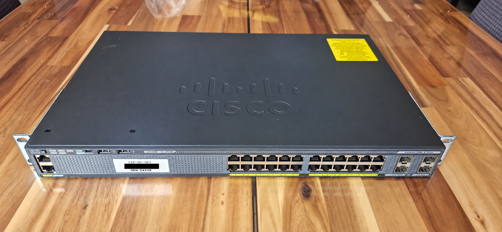

# Cisco Catalyst 2960-X (2)



## Acquisition

- Model: WS-C2960X-24TS-L
- Received: 2026-09-18
- Condition: Used

### Content

- Switch 2960x
- Rack Brackets
- Power cable

---

## Why this switch?

The Cisco Catalyst 2960-X was selected to practice and reinforce the switching concepts covered in the CCNA certification on real enterprise hardware.

It provides a physical environment for working with VLANs, trunking, Spanning Tree Protocol, EtherChannel, port security, DHCP Snooping, Dynamic ARP Inspection, SSH management and general Layer 2 troubleshooting.

Using real Cisco hardware also allows me to become familiar with physical deployment, console access, cabling, interface status, hardware inspection and operational troubleshooting beyond network simulation tools.

---

## Role in the homelab

This switch will operate as a Layer 2 access switch within the homelab.

Its main responsibilities will include:

- Connecting end devices and lab equipment
- Providing VLAN segmentation
- Carrying multiple VLANs over trunk links
- Applying Layer 2 security features
- Providing management access through a dedicated management VLAN
- Connecting to the future Layer 3 / firewall infrastructure
- Serving as a platform for CCNA review and future CCNP switching practice

---

## Initial inspection

- Visual inspection
- Power-on test
- Port LEDs verification
- Console access test

---

## Software

IOS : 15.2(2)E7

VID : V05

---

## Initial verification

Commands used:

```text
show version
show switch
show inventory
show interfaces status
show vlan brief
show run
```
### Story

When I powered on the switch, a banner appeared stating that the device belonged to a company and that any unauthorized operation on it was strictly prohibited.

Apparently, the switch had not been properly decommissioned before being sold. I therefore contacted the seller, explained the situation, and asked what I was legally allowed to do with the device.

Three days later, I received confirmation that I was now the full owner of the equipment and that I was authorized to erase the previous configuration and restore the switch to its factory-default state.

I was then able to perform the factory reset and begin configuring the switch for my homelab.

---

## Conclusion 

After two days of testing, the switch appears to be running perfectly.