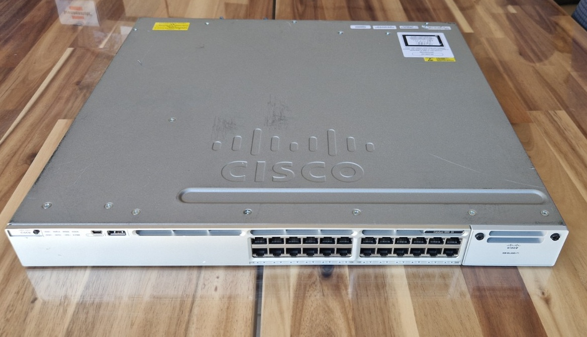
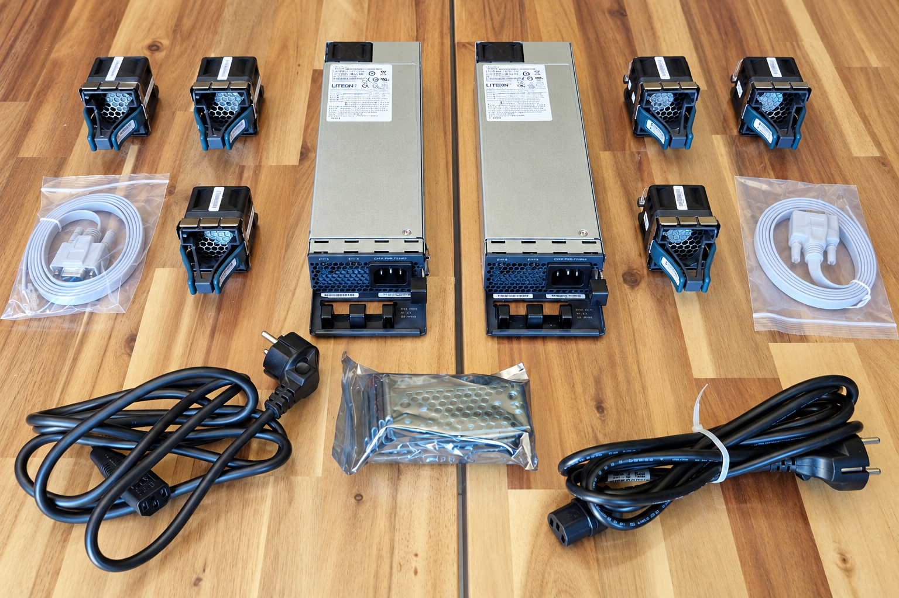

# Cisco Catalyst WS-C3850-24T-E (1)



## Acquisition

- Model: WS-C3850-24T-E
- Received: 2026-09-21
- Condition: Used

### Package Contents



2× Cisco Catalyst WS-C3850-24T-E

2× Power Supply Units (1 per switch)

6× Fan modules (3 per switch)

2× Power cables (1 per switch)

2× Console cables (1 per switch)

2× Rack bracket kits (1 per switch)

---

## Why this switch?

The Cisco Catalyst WS-C3850-24T-E was selected to practice and reinforce the routing concepts covered in the CCNA certification on real enterprise hardware.

It provides a physical environment for working with routing tables, static routing, dynamic routing protocols, inter-VLAN routing, SVIs, first-hop redundancy protocols, and general Layer 3 troubleshooting.

Using real Cisco hardware also allows me to become familiar with physical deployment, console access, cabling, interface status, hardware inspection, and operational troubleshooting beyond network simulation tools.

---

## Role in the homelab

The two Catalyst 3850 switches will be used to build a redundant Layer 3 distribution/core design.

Gateway redundancy will be provided using HSRP or VRRP, while Spanning Tree and EtherChannel will be used to provide redundant Layer 2 paths toward the access switches.

Its main responsibilities will include:

- Connecting access switches and providing inter-VLAN routing
- Providing SVIs for VLANs
- Performing Layer 3 routing
- Providing gateway redundancy between the active and standby Layer 3 switches
- Serving as a platform for CCNA review and future CCNP routing practice

---

## Initial inspection

- Visual inspection
- Power-on test
- Port LED verification
- Console access test

---

## Software

- IOS XE: 16.12.8
- IP Services
- VID: V07

---

## Initial verification

Commands used:

```text
show version
show switch
show inventory
show environment
show interfaces status
show vlan brief
show running-config
```

---

## Conclusion 

After two days of testing, the switch appears to be running perfectly.

