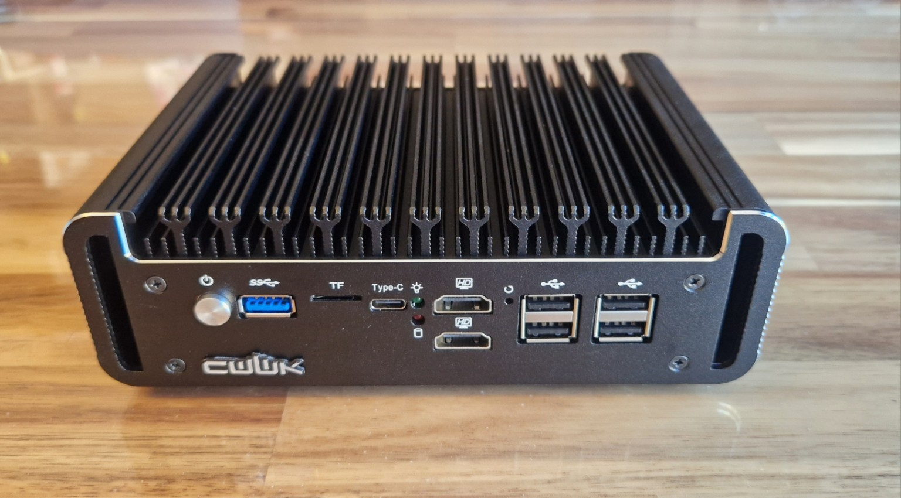
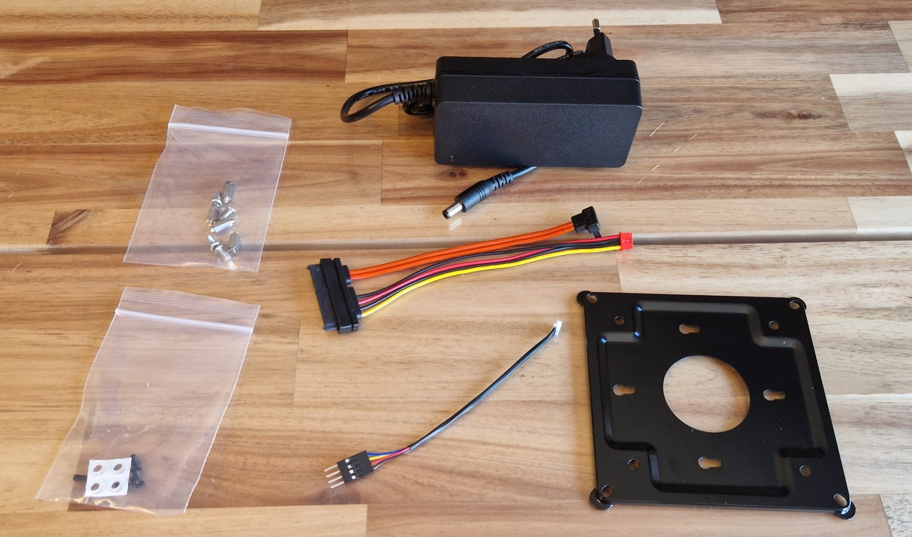

# CWWK Mini PC - pfSense

## Acquisition

- Model: CWWK Mini PC
- Received: 2026.10.06
- Condition: New

### Package Contents

- CWWK Mini PC
- Power adapter
- SATA/power cable
- Mounting bracket
- Screws and mounting hardware

---

## Why this device?

This device was chosen for its hardware capabilities and connectivity options.

- CPU: Intel Processor N300
- RAM: 8 GB
- SSD: 128 GB NVMe
- NIC: 6 × Intel i226-V 2.5 GbE
- USB 3.0 port
- USB ports
- USB-C
- TF / microSD slot
- HDMI outputs

I chose the Intel N300 because it offers 8 cores / 8 threads, compared with 4 cores / 4 threads on the N150.

This additional processing headroom will be useful when running several network services simultaneously, such as:

- Inter-VLAN routing
- Firewalling
- VPN services
- IDS / IPS
- NAT / PAT
- Traffic processing across 2.5 GbE interfaces

---

## Role in the homelab

This device will act as the main firewall and router of the homelab.

Its main responsibilities will include:

- Traffic filtering and firewall rules
- Inter-VLAN routing
- NAT / PAT
- VPN services
- IDS / IPS with Suricata or Snort
- Network segmentation and DMZ
- Traffic shaping / QoS
- Network monitoring and traffic analysis

---

## Initial inspection

- Visual inspection
- Power-on test
- Port LED verification
- Console access test

---

## Software

This device will run pfSense Community Edition (pfSense CE), an open-source firewall and routing operating system based on FreeBSD.

pfSense was chosen because it provides a complete set of networking and security features and is well suited for a homelab environment.

---

## Conclusion

This CWWK appliance will become a key component of my homelab by acting as the main firewall and router.

With its Intel N300 processor, 8 GB of RAM and six 2.5 GbE interfaces, it provides enough performance and flexibility to experiment with advanced networking and security features such as VLAN segmentation, VPNs, IDS/IPS, NAT, traffic shaping and network monitoring.

Running pfSense Community Edition will allow me to move from simulated networking labs to a real firewall environment and gain hands-on experience with technologies commonly used in network and security infrastructures.