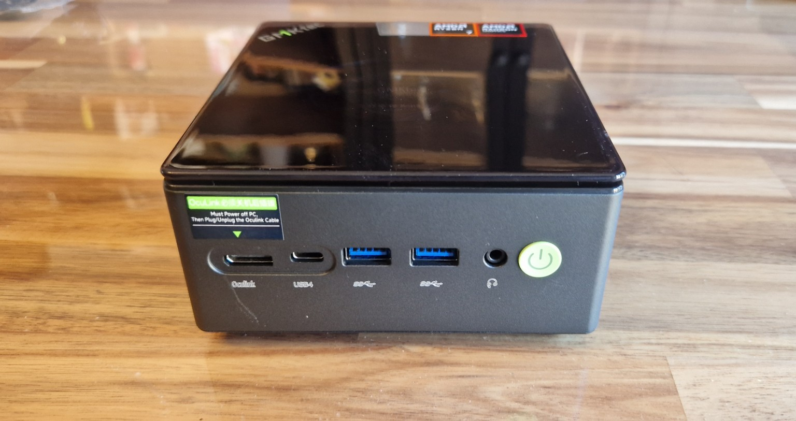
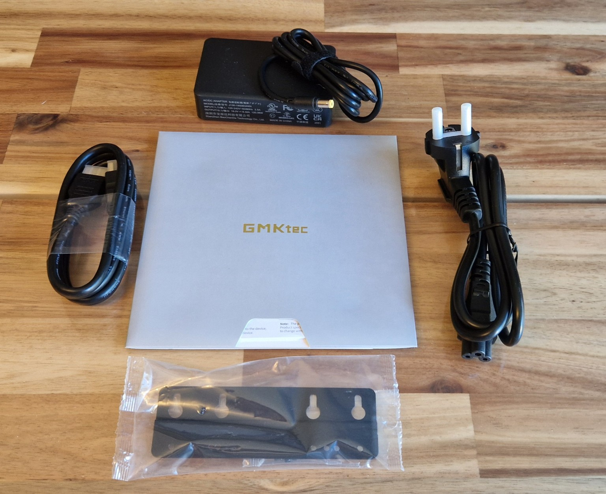

# GMKtec NucBox K8 Plus

## Acquisition

- Model: GMKtec NucBox K8 Plus
- Received: 2026.10.06
- Condition: New

### Package Contents

- GMKtec NucBox K8 Plus
- Power adapter
- AC power cable
- HDMI cable
- VESA mounting bracket
- Mounting screws
- User documentation

---

## Why this device?

The GMKtec NucBox K8 Plus was chosen for its hardware configuration, compact form factor and connectivity options.

- CPU: AMD Ryzen 7 8845HS — 8 cores / 16 threads
- GPU: AMD Radeon 780M
- RAM: 32 GB
- Storage: 1 TB NVMe SSD
- Network: 2 × Intel i226-V 2.5 GbE
- USB: 2 × USB4 Type-C (40 Gbps)
- HDMI 2.1
- DisplayPort 2.1
- OCuLink PCIe Gen4 ×4
- USB-A ports
- Wi-Fi: Wi-Fi 6
- Bluetooth: Bluetooth 5.2

I chose the 32 GB RAM configuration because I already have a ThinkPad equipped with 32 GB of RAM that can be used alongside the homelab.

Given the current cost of memory, I preferred to use the ThinkPad as an additional client or attacker machine for lab environments rather than investing immediately in a larger amount of RAM for the Proxmox host.

This setup allows me to distribute workloads between the Proxmox server and my laptop while still leaving the possibility of upgrading the K8 Plus later if required.

---

## Role in the homelab

The main role of the K8 Plus will be virtualization, allowing me to build and run different lab environments depending on what I am studying.

Its main responsibilities will include:

- Windows Server virtual machines
- Linux Server virtual machines
- Active Directory lab environments
- Security lab environments
- Network services such as DNS, DHCP and monitoring
- Temporary testing environments
- Snapshots and rollback testing
- Multi-machine virtual lab environments

---

## Software

This device will run Proxmox Virtual Environment (Proxmox VE), an open-source virtualization platform based on Debian Linux.

Proxmox VE was chosen because it provides a complete environment for centrally managing virtual machines, containers, storage and virtual networking through a web-based interface.

It will allow me to:

- Create and manage virtual machines
- Run Linux containers (LXC)
- Create and manage snapshots
- Configure virtual networking
- Build isolated lab environments
- Test Windows Server, Linux and Active Directory environments
- Manage backups and restores
- Experiment with different infrastructure and security scenarios

---

## Conclusion

The GMKtec NucBox K8 Plus will serve as the main virtualization host of my homelab.

With its AMD Ryzen 7 8845HS, 32 GB of RAM, 1 TB NVMe SSD and dual 2.5 GbE interfaces, it provides enough performance and flexibility to run multiple virtual machines and lab environments simultaneously.

Running Proxmox VE will allow me to build, test and manage Windows Server, Linux, Active Directory, networking and security environments from a single platform.

Combined with my physical networking equipment and additional client systems, the K8 Plus will allow me to move from isolated exercises to more complete and interconnected infrastructure labs.