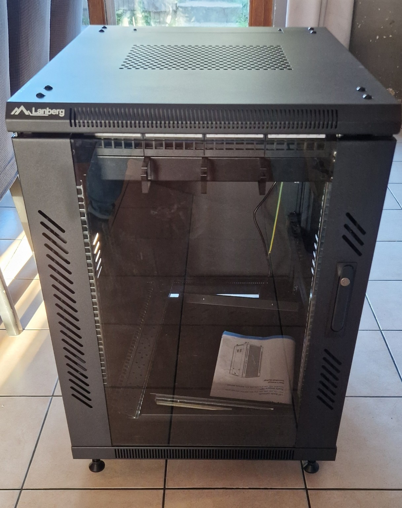

# Lanberg Cabinet Rack FF01

## Acquisition

Model: Lanberg Cabinet Rack FF01-6815-12B 15U  
Received: 2026-10-05  
Condition: New

## Package Contents

- Rack structure to assemble
- Glass front door
- Rear door
- Removable and lockable side panels
- 4 × 19" mounting rails
- Locking casters
- Adjustable feet
- Ventilation panel with 4 fans
- Grounding kit for the chassis and doors
- Mounting hardware: M8 screws, M8 nuts, M6 cage nuts, M6 screws and several self-tapping screws

**Note:** I encountered several issues while assembling this Lanberg rack. One part of the main frame was bent, but fortunately this did not affect the final assembly.

Once the frame had been straightened using leverage, I was able to start assembling the rack.

That was when I encountered another issue: when I tried to insert the M6 screws used to secure the different parts of the frame together, I realized that several mounting points were simply not threaded.

The issue affected all 16 mounting points located on the top and bottom sections of the rack. As a result, the supplied M6 screws could not be properly tightened.

After reviewing the documentation, doing some research on forums, and using AI to compare possible solutions, I decided to work around the issue by using M6 nuts together with washers.

This solution allowed me to securely fasten the different parts of the rack and continue the assembly despite this manufacturing defect.

The rest of the assembly went very smoothly. The only other issue I encountered was, this time, caused by a mistake on my part.

While installing the horizontal rails, I had positioned the cage nuts the wrong way, facing toward the inside of the rack. When I tried to install the shelf and the different switches, none of the equipment would fit properly: I was missing approximately 1 cm of clearance.

After checking the rack dimensions, the equipment, and the positioning of the different parts, I went back through the assembly step by step. I then noticed that the cage nuts were protruding by approximately 5 mm on each side toward the inside of the rack.

That explained exactly where the missing centimeter had gone.

After repositioning the cage nuts correctly, all the equipment fitted into the rack normally.

This small mistake also reminded me of something important: when a problem occurs during an installation, it is sometimes better to calmly go back through each step and double-check your own work before assuming that the hardware itself is defective.

---

## Why this rack?

I chose this 15U rack mainly because of its excellent price-to-quality and price-to-feature ratio.

- Fully enclosed and lockable rack
- Mounted on casters for easy movement
- 15U / 19" format, providing enough space for future homelab expansion
- Dimensions: 848 × 600 × 800 mm
- Adjustable 19" mounting rails
- Maximum supported load of 800 kg, providing plenty of margin for my equipment
- 4 top-mounted exhaust fans
- Removable side panels, making installation, cabling and maintenance easier
- Sufficient depth for my network equipment while remaining suitable for a home lab environment

The 15U format was also a good compromise: large enough to accommodate my current equipment and leave room for future expansion, without requiring a much larger rack.

---

## Role in the homelab

Its main role is to house, organize and protect all of my network equipment and homelab infrastructure.

Its main responsibilities will include:

- Centralizing all network equipment in one location
- Housing the switches, pfSense firewall, Proxmox server and other equipment
- Keeping network and power cabling organized
- Protecting the equipment with an enclosed and lockable structure
- Improving airflow and heat extraction

---

## Observations

- The rack has a slight amount of play in some of the doors, particularly the rear door
- Some threaded mounting points had manufacturing defects
- Part of the rack frame was delivered slightly bent
- These defects made the assembly and alignment of some parts slightly more difficult

---

## Conclusion

Overall, this Lanberg rack offers good general build quality despite a few manufacturing defects, including some defective threaded mounting points and a slightly bent part of the frame.

These issues made the assembly a little more complicated than expected, but they do not prevent the rack from performing its intended role once fully assembled.

The price-to-quality ratio remains very good, especially considering the 15U format, casters, removable panels, lockable doors and integrated ventilation system.