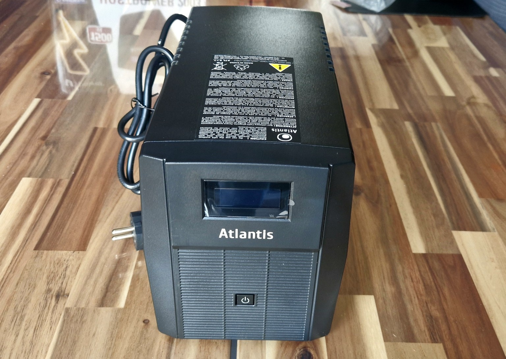

# UPS Atlantis A03-HP2003

## Acquisition

- Model: A03-HP2003
- Received: 2026-10-07
- Condition: New

### Package Contents

- UPS Atlantis A03-HP2003
- Manuel

---

## Why this UPS?

J'ai choisis cette UPS car il remplit plueirus fonction indispensable pour un rack : 

- Puissance de 1500 VA / 900 W, largement suffisante pour alimenter les équipements principaux du homelab.
- Protection contre les coupures de courant, permettant aux équipements de continuer à fonctionner pendant une courte période en cas de panne secteur.
- Protection contre les variations et perturbations électriques, utile pour du matériel réseau et informatique fonctionnant plusieurs heures.
- Interface USB HID, permettant de connecter l'UPS à un serveur, notamment Proxmox, afin de surveiller son état et d'automatiser un arrêt propre des machines en cas de coupure prolongée.
- Bon rapport capacité/prix pour une infrastructure personnelle ne nécessitant pas un UPS professionnel beaucoup plus coûteux.

---

## Role in the homelab

L’UPS Atlantis A03-HP2003 protégera les équipements du homelab contre les coupures de courant, les surtensions et les variations de tension. 
Il servira également à maintenir temporairement les équipements critiques en fonctionnement et à permettre un arrêt propre du serveur Proxmox en cas de coupure prolongée.

---

## Observations

Observation: L’UPS est relativement compact malgré sa capacité de 1500 VA / 900 W. L’écran LCD permet de consulter rapidement son état et la charge.
La présence d’une connexion USB HID permettra également de l’intégrer à Proxmox afin de surveiller l’alimentation et de gérer un arrêt propre en cas de coupure prolongée.

---

## Conclusion

L’Atlantis A03-HP2003 complète l’infrastructure du homelab en ajoutant une protection électrique aux équipements critiques. Sa capacité de 1500 VA / 900 W est adaptée à la consommation prévue de l’installation.

---

