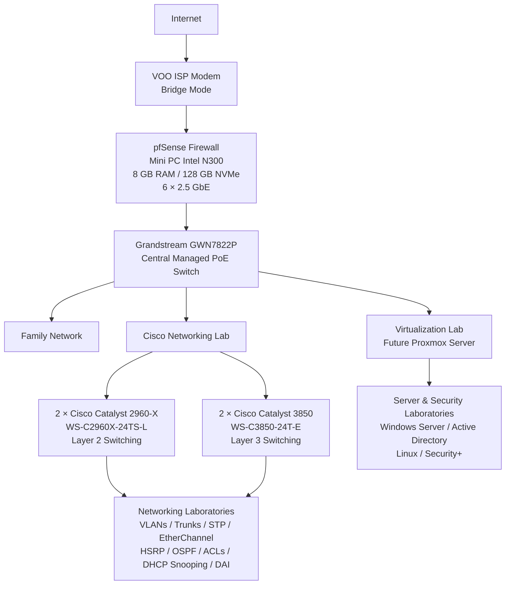

# 🏠 Homelab Infrastructure Project

This repository documents the design, deployment, operation, and evolution of my personal IT homelab.

The project was created to move beyond simulated environments such as Cisco Packet Tracer and GNS3 and apply the networking knowledge acquired through my CompTIA Network+ and Cisco CCNA studies to real enterprise hardware.

The environment is being built progressively around Cisco switching, MikroTik, pfSense, Proxmox, Windows Server, Active Directory, and Linux.

Its purpose is not only to build a working infrastructure, but to document the complete engineering process:

**design → deployment → verification → troubleshooting → improvement**

The homelab will also serve as a practical platform for future CCNP and Security+ studies.

---

## 🚧 Current status

The homelab is currently in the early deployment stage.

### Completed

- ✅ [First Cisco Catalyst 2960-x acquired and validated](Materials/Cisco-Switchs/Cisco-2960x-1/README.md)
- ✅ [Second Cisco Catalyst 2960-X acquired and validated](Materials/Cisco-Switchs/Cisco-2960x-2/README.md)
- ✅ Initial hardware inspection and console access completed
- ✅ IOS and factory-default configuration verified
- ✅ First device documentation published

### In progress

- 🔄 Cisco lab deployment
- 🔄 Physical network and VLAN design
- 🔄 Repository structure and documentation
- 🔄 Homelab architecture planning

### Upcoming

- ⬜ Second Cisco Catalyst 2960-X
- ⬜ Cisco Catalyst 3650 switches
- ⬜ Grandstream GWN7822P
- ⬜ pfSense firewall/router
- ⬜ 15U rack deployment
- ⬜ VLAN segmentation and inter-VLAN routing
- ⬜ Proxmox virtualization platform
- ⬜ Integration of Windows Server, Active Directory, and Linux systems
---

## 🎯 Objectives

The main objectives of this homelab are to:

- Apply CCNA networking knowledge on physical enterprise hardware
- Design and operate a segmented multi-VLAN network
- Practice Layer 2 and Layer 3 networking
- Implement inter-VLAN routing
- Deploy routing, firewalling, and NAT with pfSense
- Practice structured network troubleshooting
- Deploy Windows Server, Active Directory, and Linux services
- Learn virtualization with Proxmox
- Build a secure remote administration environment
- Apply network security features on real equipment
- Document configurations, failures, troubleshooting, and solutions
- Support future CCNP and Security+ studies

---
## 🗺️ Target architecture

The homelab is being built progressively around the following target architecture:

### Component roles

| Component | Role |
|---|---|
| **VOO ISP Modem** | Internet access, configured in bridge mode so pfSense can act as the main router and firewall |
| **pfSense Mini PC** | Main firewall, routing, NAT, VLAN gateways and network security |
| **Grandstream GWN7822P** | Central managed switch connecting the family network, Cisco lab and future virtualization infrastructure |
| **2 × Cisco Catalyst 2960-X WS-C2960X-24TS-L** | Layer 2 laboratory switches used for VLANs, trunks, STP, EtherChannel, Port Security, DHCP Snooping and DAI |
| **2 × Cisco Catalyst 3850 WS-C3850-24T-E** | Layer 3 laboratory switches used for inter-VLAN routing, HSRP, OSPF, ACLs and advanced switching/routing labs |
| **Future Proxmox Server** | Virtualization platform for Windows Server, Active Directory, Linux, Security+ and other infrastructure laboratories |

> The architecture will progressively evolve as additional servers, virtual machines, clients and network services are added.
---

## 🌐 Planned network segmentation

The initial segmentation plan is:

| VLAN | Purpose |
|---|---|
| VLAN 10 | Family network |
| VLAN 50 | Homelab network |
| VLAN 100 | Virtualization / servers |
| Management VLAN | Network device administration |

Inter-VLAN routing and firewall policies will be handled by pfSense.

The main goal is to isolate the lab environment from the family network while still allowing controlled Internet access and management traffic.

---

## 🖥️ Hardware

Each major device has its own documentation folder under `Materials/`.

| Status | Device | Role |
|---|---|---|
| ✅ | Cisco Catalyst WS-C2960X-24TS-L #1 | Layer 2 access switch |
| ⬜ | Cisco Catalyst WS-C2960X-24TS-L #2 | Layer 2 access switch |
| ⬜ | Cisco Catalyst 3650 #1 | Layer 3 distribution / collapsed-core |
| ⬜ | Cisco Catalyst 3650 #2 | Layer 3 distribution / collapsed-core |
| ⬜ | Grandstream GWN7822P | Central VLAN switching |
| ⬜ | Mini PC — pfSense | Firewall / router |
| ⬜ | Mini PC — Proxmox | Virtualization host |
| ⬜ | 15U rack | Physical infrastructure |

Smaller accessories such as console cables, patch cables, keystone modules, and patch-panel components are documented separately under `Materials/Accessory/`.

---

## 🧱 Cisco lab

The Cisco lab provides a physical environment for practicing and extending the networking concepts studied through CCNA and future CCNP work.

Main areas:

- Layer 2 switching: VLANs, trunking, STP/RPVST+, EtherChannel
- Layer 2 security: Port Security, DHCP Snooping, DAI, BPDU Guard
- Layer 3 networking: inter-VLAN routing, static and dynamic routing, IPv4/IPv6
- First-hop redundancy: HSRP for IPv4 and HSRPv2 for IPv6
- Network architecture: access/distribution roles and collapsed-core design
- Management and hardening: SSH, management VLANs, device security
- Troubleshooting, validation, redundancy, and failover testing

The long-term objective is to reuse the same physical infrastructure for more advanced CCNP-oriented labs.

---

## 🖥️ Virtualization and systems lab

The virtualization and systems lab is used to deploy, integrate, and troubleshoot Windows and Linux environments.

Main areas:

- Proxmox virtualization and virtual networking
- Windows Server and Active Directory
- Windows client integration and Group Policy
- Linux server administration
- DNS, DHCP, file services, and authentication
- Logging, monitoring, backups, and security
- Integration with the physical VLAN infrastructure
- Structured systems troubleshooting

A dedicated Proxmox host is planned.

In the meantime, Windows Server and Active Directory labs are already being performed on Hyper-V using a laptop with 32 GB of RAM.

---

## 📚 Documentation approach

Documentation is intentionally separated into two areas.

### `Materials/`

The `Materials/` directory acts as the equipment identity card.

Each device folder may contain:

- Why the equipment was selected
- Acquisition information
- Physical condition
- Initial inspection
- Software version
- Hardware verification
- Photos
- Current status

Example:

    Materials/
    └── Cisco-Switches/
        └── Cisco-2960X-01/
            ├── README.md
            └── images/

### `Labs/`

The lab folders document what is actually built with the equipment.

Each lab follows a consistent structure:

1. **Objective**
2. **Topology**
3. **Configuration**
4. **Verification**
5. **Troubleshooting**
6. **Solution**
7. **Lessons learned**

Failed attempts are documented alongside successful implementations.

The goal is to show the real engineering process rather than only the final working configuration.

---

## 🔐 Security principles

### Infrastructure

The homelab is designed with security in mind.

Planned and implemented practices include:

- SSH-only administration
- No Telnet
- Dedicated management VLAN
- Local authentication
- Firewall policies
- Network segmentation
- DHCP Snooping
- Dynamic ARP Inspection
- Port Security
- BPDU Guard
- Secure device credentials
- Centralized logging
- Monitoring
- Controlled inter-VLAN communication
- Restricted management access
- Separation between family and lab networks

### Repository

Sensitive information is never intentionally committed.

Repository rules include:

- No passwords
- No private keys
- No real public IP addresses
- No API tokens
- No sensitive credentials
- No unsanitized configuration backups
- Configuration files sanitized before publication
- Secrets checked before commits

---

## 📂 Repository structure

    Homelab/
    │
    ├── README.md
    ├── CHANGELOG.md
    ├── .gitignore
    │
    ├── Materials/
    │   ├── Cisco-Switches/
    │   │   └── Cisco-2960X-01/
    │   │       ├── README.md
    │   │       └── images/
    │   ├── Grandstream/
    │   ├── pfSense/
    │   ├── Proxmox/
    │   ├── Rack/
    │   └── Accessory/
    │
    ├── Labs/
    │   ├── Cisco/
    │   └── Virtualization/
    │
    ├── Configs/
    │   ├── Cisco/
    │   ├── pfSense/
    │   └── Grandstream/
    │
    ├── Diagrams/
    │   ├── Physical/
    │   └── Logical/
    │
    └── Troubleshooting/

---

## 🛠️ Phase 1 — Network infrastructure

- [x] First Cisco Catalyst 2960-X acquired and validated
- [ ] Second Cisco Catalyst 2960-X acquired
- [ ] First Cisco Catalyst 3650 switches acquired
- [ ] Second Cisco Catalyst 3650 switches acquired
- [ ] Grandstream Switch acquired
- [ ] pfSense mini PC acquired
- [ ] 15U rack installed
- [ ] Core network architecture deployed
- [ ] VLAN segmentation implemented
- [ ] Inter-VLAN routing and firewall policies deployed
- [ ] Cisco lab fully integrated into the homelab

---

## 🖥️ Phase 2 — Virtualization and systems

- [x] Windows Server and Active Directory labs started on Hyper-V (Laptop)
- [ ] Proxmox host acquired
- [ ] Proxmox virtualization platform deployed
- [ ] Windows Server and Active Directory environment migrated to Proxmox
- [ ] Linux server environment deployed
- [ ] Virtualization lab integrated with the physical network
- [ ] Monitoring and centralized logging implemented
- [ ] Backup strategy implemented

---

## 🔐 Phase 3 — Advanced networking and security

Future areas include:

- Advanced routing, redundancy, and high availability
- VPN, AAA, and centralized authentication
- Network monitoring, Syslog, and SNMP
- Network hardening and advanced firewall policies
- Automation, CCNP-oriented labs, and Security+-oriented labs

---

## 🧪 Troubleshooting philosophy

Troubleshooting is treated as an important part of the project.

Problems are documented whenever possible with:

- Symptoms
- Initial assumptions
- Verification commands
- Root cause
- Corrective action
- Final validation
- Lessons learned

The goal is not to hide failures, but to use them as part of the learning process.

---

## 🚀 Project philosophy

This homelab is a long-term learning environment.

The objective is not to build everything at once, but to progressively design, deploy, test, break, troubleshoot, improve, and document the infrastructure.

The repository is therefore intended to show not only the final architecture, but also the decisions, mistakes, troubleshooting process, and lessons learned during the project.

**Work in progress — continuously evolving.**